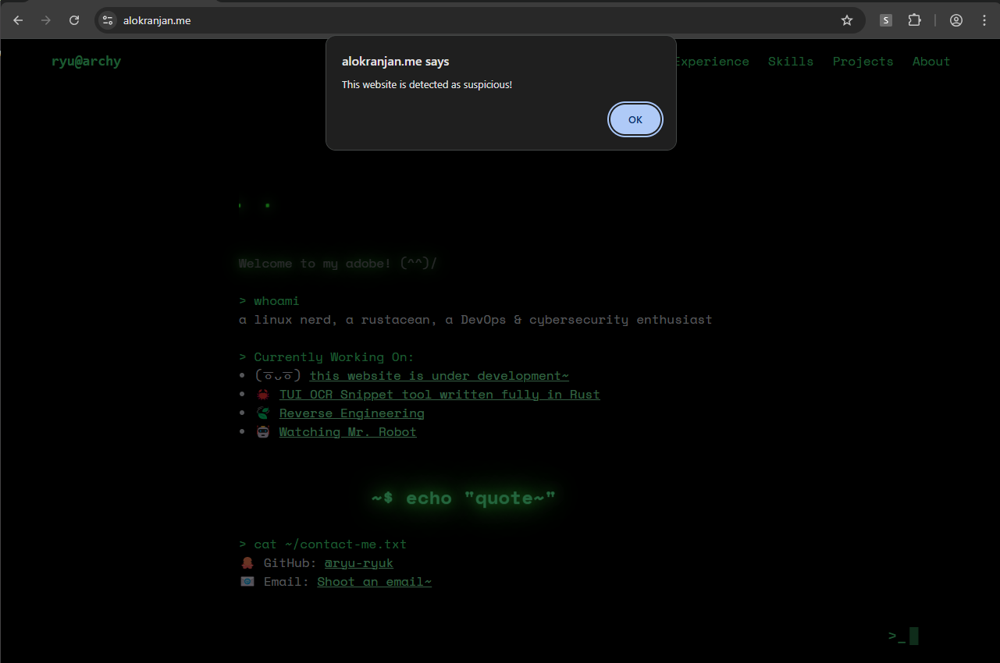
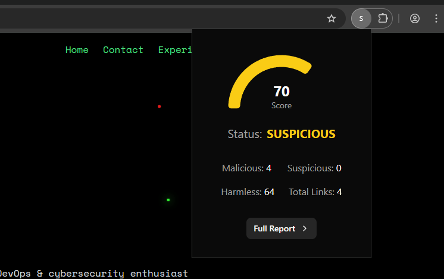

# 🔒 SecureScan - Browser Extension


> A powerful browser extension that scans and visualizes domain threat levels in real-time using external APIs like VirusTotal and URLScan.
---

## 🖼️ Screenshots



---

## 📂 Project Structure

```bash
|-- dist
|   |-- assets
|   |   `-- index-CuPBjqHF.css
|   |-- background.js
|   |-- content.js
|   |-- index.html
|   |-- index.js
|   |-- main.js
|   `-- manifest.json
|-- public
|   |-- main.js
|   `-- manifest.json
|-- src
|   |-- App.tsx
|   |-- background.ts
|   |-- components
|   |   |-- Data
|   |   |   `-- Data.tsx
|   |   |-- Error
|   |   |   `-- Error.tsx
|   |   |-- Loading
|   |   |   `-- Loading.tsx
|   |   |-- RadialChart
|   |   |   `-- Chart.tsx
|   |   |-- Summary
|   |   |   |-- Summary.tsx
|   |   |   `-- SummaryItem.tsx
|   |   `-- ui
|   |       |-- button.tsx
|   |       |-- card.tsx
|   |       `-- chart.tsx
|   |-- content.ts
|   |-- index.css
|   |-- lib
|   |   `-- utils.ts
|   |-- main.tsx
|   `-- vite-env.d.ts
|-- components.json
|-- eslint.config.js
|-- index.html
|-- package-lock.json
|-- package.json
|-- README.md
|-- tsconfig.app.json
|-- tsconfig.json
|-- tsconfig.node.json
`-- vite.config.ts
```
---

## 🛠️ Tech Stack

* **Languages**: TypeScript, JavaScript
* **Framework**: React.js
* **Styling**: TailwindCSS, Sass
* **Build Tool**: Vite
* **Browser Extension APIs**: Chrome (Content & Background Scripts)
---

## 🚀 Getting Started

### 1. Clone the repository (if have not already)

```bash
git clone https://github.com/tabishraza302/SecureScan.git
```

### 2. Navigate to the extension directory

```bash
cd SecureScan/extension
```

### 3. Install dependencies

```bash
npm install
```

### 4. Build the project

```bash
npm run build
```

### 5. Load the extension in Chrome

* Go to `chrome://extensions/`
* Enable **Developer Mode**
* Click on **Load unpacked**
* Select the `dist/` folder

---

## 📄 License

This project is licensed under the **MIT License** – see the [LICENSE](LICENSE) file for details.

---

## 🙋‍♂️ Author

**Tabish Raza**
🔗 [LinkedIn](https://www.linkedin.com/in/tabishraza302/)
💻 [GitHub](https://github.com/tabishraza302)

---