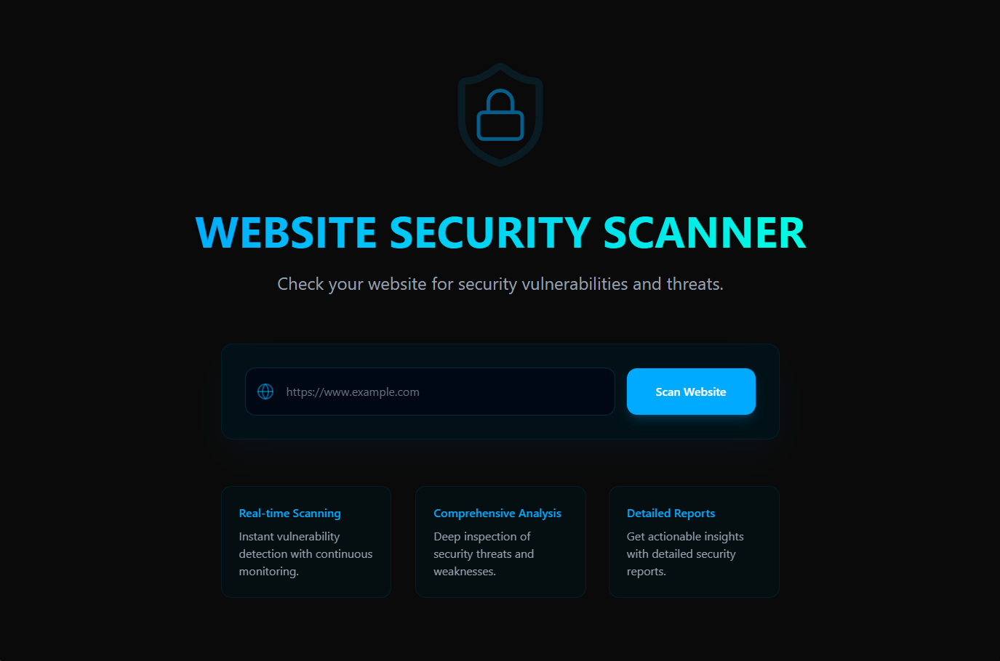
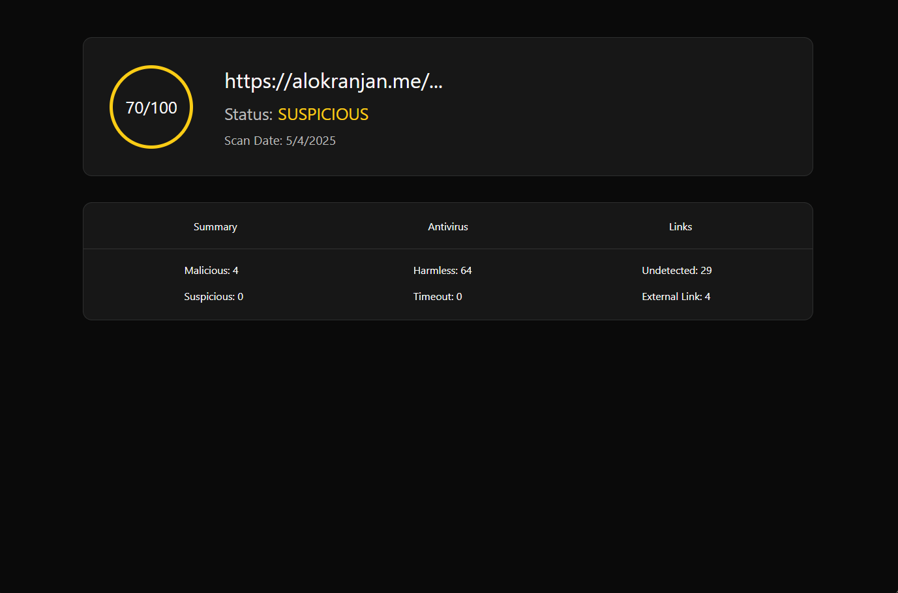
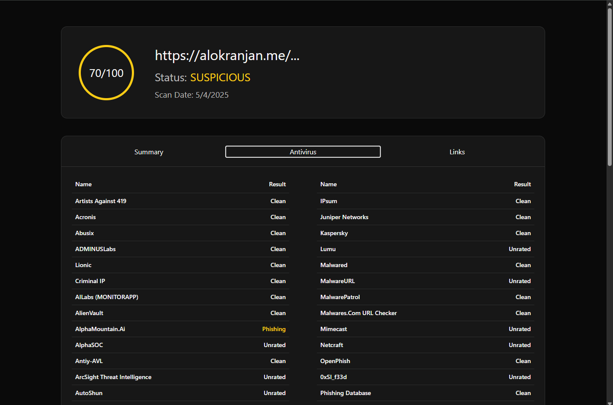
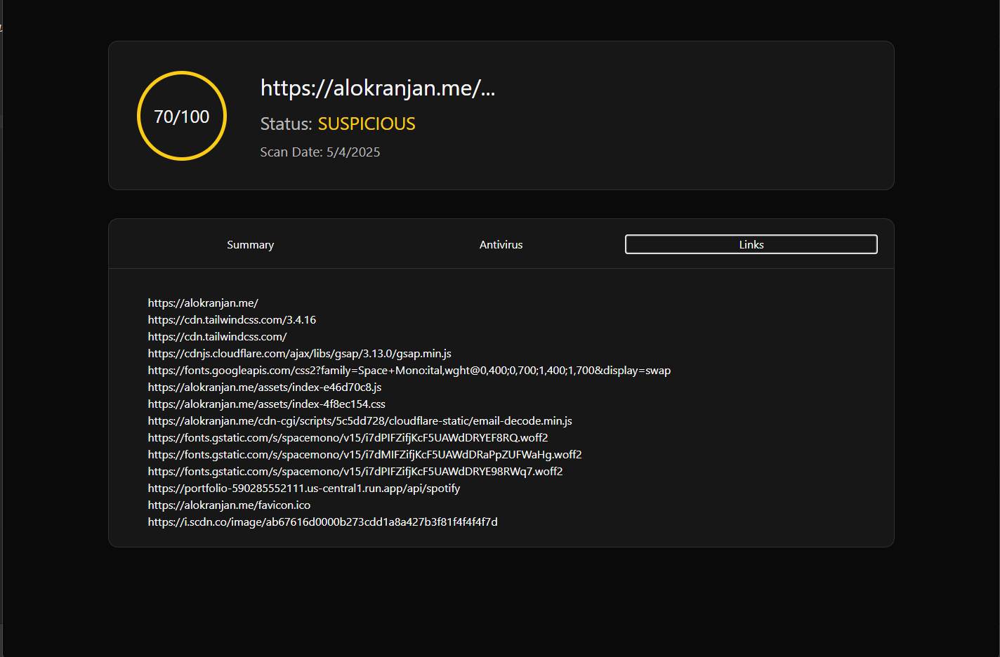

# 🔒 SecureScan - Website


> A sleek and fast web interface for the SecureScan extension that displays real-time threat analysis and detailed domain intelligence.

---

## 🖼️ Screenshots







---

## 📂 Project Structure

```bash
|-- dist
|   |-- assets
|   |   |-- index-6bWR2myE.css
|   |   `-- index-BmBx9GW_.js
|   |-- index.html
|   `-- vite.svg
|-- public
|   `-- vite.svg
|-- src
|   |-- App.tsx
|   |-- Pages
|   |   |-- FullReport
|   |   |   |-- FullReport.scss
|   |   |   `-- FullReport.tsx
|   |   `-- Home
|   |       |-- Home.module.scss
|   |       `-- Home.tsx
|   |-- components
|   |   `-- ui
|   |       |-- button.tsx
|   |       |-- card.tsx
|   |       |-- input.tsx
|   |       |-- label.tsx
|   |       |-- table.tsx
|   |       `-- tabs.tsx
|   |-- index.css
|   |-- lib
|   |   `-- utils.ts
|   |-- main.tsx
|   `-- vite-env.d.ts
|-- components.json
|-- eslint.config.js
|-- index.html
|-- package-lock.json
|-- package.json
|-- README.md
|-- tsconfig.app.json
|-- tsconfig.json
|-- tsconfig.node.json
`-- vite.config.ts
```

---

## 🛠️ Tech Stack

* **Languages**: TypeScript, JavaScript
* **Framework**: React.js
* **Styling**: TailwindCSS, Sass
* **Build Tool**: Vite
* **Extension Integration**: Connects with Chrome Extension APIs

---

## 🚀 Getting Started

### 1. Clone the Repository (if have not already)

```bash
git clone https://github.com/tabishraza302/SecureScan.git
```

### 2. Navigate to the Website Directory

```bash
cd SecureScan/website
```

### 3. Install Dependencies

```bash
npm install
```

### 4. Run the Project

```bash
npm run dev
```

Then open your browser at [http://localhost:5173](http://localhost:5173)

---

## 📄 License

This project is licensed under the **MIT License**. See the [LICENSE](LICENSE) file for details.

---

## 🙋‍♂️ Author

**Tabish Raza**
🔗 [LinkedIn](https://www.linkedin.com/in/tabishraza302/)
💻 [GitHub](https://github.com/tabishraza302)

---