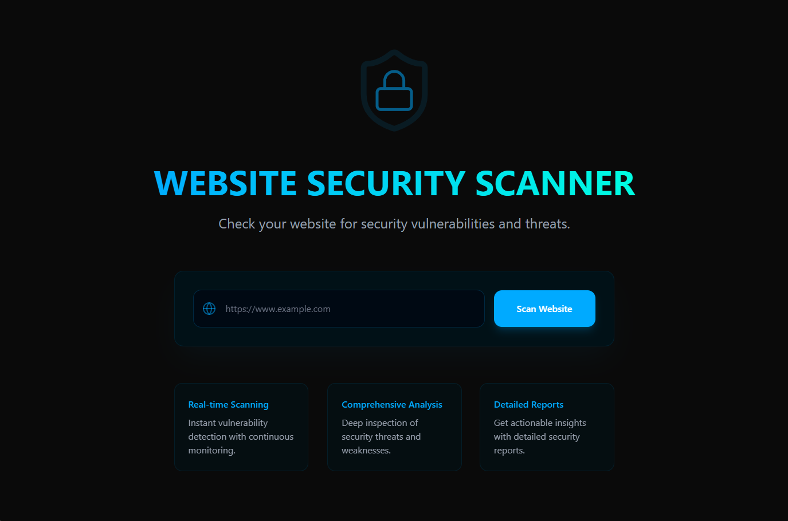

# 🔒 SecureScan Suite — Real-Time Threat Detection Platform


> **SecureScan** is a modern, privacy-first suite for real-time website threat analysis. It includes a **browser extension**, an interactive **web dashboard**, and a secure **backend API**. Powered by VirusTotal and URLScan, it detects malicious domains **before** they can do damage.

---

## 📁 Project Structure

```
SecureScan/
├── extension/     # Browser extension (React + Chrome APIs)
├── frontend/      # Web dashboard (React + TailwindCSS + Sass)
├── backend/       # Node.js + Express API server
├── screenshots/   # Demo images
├── LICENSE
└── README.md
```

---

## 🚀 Getting Started

### 🧾 Prerequisites

* Node.js (v18 or higher)
* NPM or Yarn
* Chrome (for extension testing)
* VirusTotal & URLScan API Keys

---

### 🔁 1. Clone the Repository

```bash
git clone https://github.com/tabishraza302/SecureScan.git
cd SecureScan
```

---

## 🧩 Module Setup

### 🧱 A. Browser Extension

```bash
cd extension
npm install
npm run build
```

> ✅ Load the `dist/` folder as an **unpacked extension** in `chrome://extensions/`.

---

### 🌐 B. Frontend Web Dashboard

```bash
cd frontend
npm install
npm run dev
```

> 💡 Open [http://localhost:5173](http://localhost:5173) to view the dashboard.

---

### 🖥️ C. Backend API Server

```bash
cd backend
npm install
npm run dev
```

Create a `.env` file inside the `backend/` folder:

```env
VIRUS_TOTAL_KEY=VIRUSTOTAL_KEY
URLSCANIO_KEY=URLSCAN_KEY

JWT_SECRET="this_is_my_secret"

NODE_ENV=development
ORIGIN = "*"
```

> ⚠️ Get your keys from [VirusTotal](https://www.virustotal.com/) and [URLScan.io](https://urlscan.io/).

---

## 📸 Screenshots

<p float="left">
  
  &nbsp;
  
</p>
<p float="left">
  
  &nbsp;
  
</p>
<p float="left">
  
  &nbsp;
  
</p>
---

## ⚙️ How It Works

1. 🔗 User visits a website
2. 🧩 Extension extracts the domain and sends it to the backend
3. 📡 Backend queries VirusTotal and URLScan
4. 📊 Extension displays threat level, risk summary, and graphs

---

## 🛠️ Tech Stack

* **Languages**: TypeScript, JavaScript
* **Frontend**: React, TailwindCSS, Sass
* **Extension**: Chrome APIs (Manifest v3), Content & Background Scripts
* **Backend**: Node.js, Express.js
* **External APIs**: VirusTotal, URLScan
* **Build Tool**: Vite

---

## ✅ Key Features

* 🔍 Real-time malicious domain detection
* 📊 Graphical summaries and risk indicators
* 🔐 Secure API communication
* 🧩 Modular and scalable codebase
* 🌐 Lightweight and privacy-respecting browser extension

---

## 📄 License

This project is licensed under the **MIT License**. See [LICENSE](./LICENSE) for details.

---

## 👤 Author

**Tabish Raza**
🔗 [LinkedIn](https://www.linkedin.com/in/tabishraza302)
💻 [GitHub](https://github.com/tabishraza302)

---